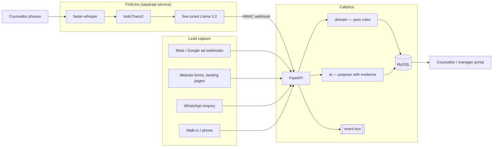

# 01 — Architecture

## System shape



## Layering

Strictly one-directional. An inner layer never imports an outer one.

```
contracts/   ← Pydantic models. Imported by everything, imports nothing but util.
domain/      ← Pure rules. Imports contracts only.
ai/          ← Pure inference. Imports contracts + domain.
db/          ← SQLAlchemy + repository. Imports contracts + domain.
services/    ← Orchestration. Imports all of the above.
api/         ← HTTP. Imports services.
integrations/← External systems. Imports contracts.
```

The payoff is the test suite: `domain/` and `ai/` hold the rules that actually
decide revenue outcomes, and both are pure functions. The full suite runs in
under two seconds with no database, no broker and no model server, which means
it gets run.

## Why FinEcho is a submodule and not an import

FinEcho's dependency tree includes torch, faster-whisper, IndicTrans2 and a
vLLM client. Importing it in-process would mean the CRM cannot start without a
GPU-class environment and could not be deployed on ordinary hosting.

So the submodule pins *the version we integrate against* — giving reproducible
builds and letting a developer read FinEcho's source in one checkout — while
the runtime relationship is HTTP:

- **FinEcho → Callytics**: `POST /webhooks/finecho/call`, HMAC-SHA256 over the
  raw body, idempotent on FinEcho's `call_id`. This is the hot path.
- **Callytics → FinEcho**: fetch a call, or request a re-evaluation of a
  disputed score. FinEcho runs reruns on its Lane B queue, so a manager's
  dispute never delays live transcription.

The two systems share nothing but this contract and the phone-number
normalisation rule — which must stay identical in both, or call-to-lead
matching silently fails.

## Idempotency

Every producer in this system is at-least-once — ad webhooks redeliver,
FinEcho retries, telephony vendors double-post. So every write path is keyed:

| Path | Key |
|---|---|
| Lead capture | `capture:{system}:{external_id}` |
| Activity | `dedupe_key` (unique index) |
| Call intelligence | FinEcho `call_id` (primary key) |
| Proposal | `finecho:call_intelligence:{call_id}:{stage}` |
| Bus consumer | `processed_events(event_id, consumer_group)` |

A redelivery is a no-op, not a duplicate. This is tested directly
(`test_capture_is_idempotent_on_webhook_redelivery`,
`test_finecho_webhook_is_idempotent`).

## Authentication

The API is service-to-service: a shared bearer token, plus `X-User-Id` for
attribution. The portal authenticates the human and calls this API on their
behalf.

Actions that change a lead's meaning require `require_human` — a service token
alone gets a 403. Accepting a proposal is one of them, deliberately: the whole
trust model depends on decisions being attributable to a person.

## Deployment

Stateless API behind a reverse proxy; MySQL as the store; the event bus is
Kafka in production and in-memory for tests, behind one interface so the choice
stays reversible. Nothing in the request path requires the broker — an outage
degrades async projections, not lead capture.
